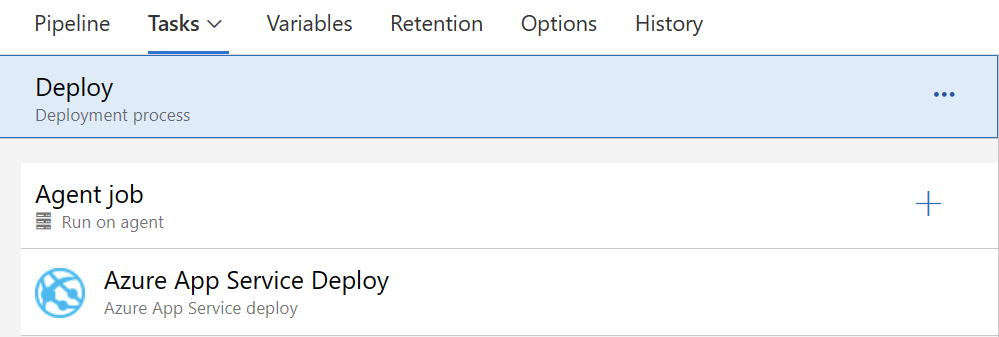
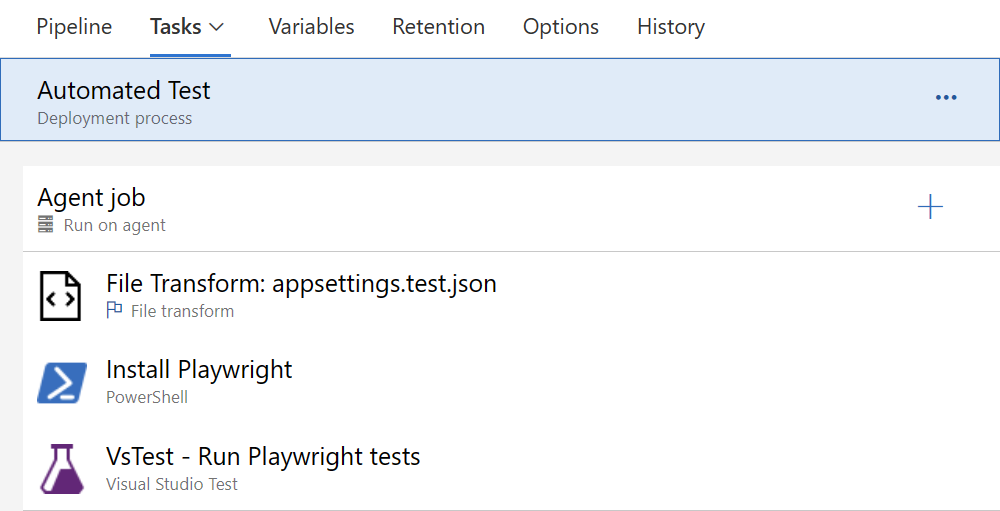

# azdo-testplans-playwright

---

| Page Type | Languages | Key Services                                                          | Tools                         |
| --------- | --------- | --------------------------------------------------------------------- | ----------------------------- |
| Sample    | .NET Core | Azure App Service   Azure DevOps (Pipelines, Releases, Test Plans) | Playwright   Visual Studio |

---

# Running end-to-end Playwright tests in Azure DevOps with Test Plans

This sample codebase demonstrates how to set up and run automated Playwright tests in Azure DevOps using Test Plans against a web application running on App Service in Azure.
 
This example should be viewed as a foundation for modification and expansion into more complex applications.

## Prerequisites

-   [An Azure Subscription](https://azure.microsoft.com/en-us/free/) - for hosting cloud infrastructure
-   [Azure DevOps with Test Plans licensing](https://azure.microsoft.com/en-us/products/devops/test-plans) - for managing and running automated tests
-   [Az CLI](https://learn.microsoft.com/en-us/cli/azure/install-azure-cli) - for deploying Azure infrastructure as code
-   [.NET Core](https://dotnet.microsoft.com/en-us/download/dotnet/6.0) - for web application and Playwright development
-   [Visual Studio](https://visualstudio.microsoft.com/) - for development and associating test cases to plans

## Running this sample

### Setting Up the Cloud Infrastructure

-   Run the script `Devops/Infrastructure/env.ps1`, passing in your desired resource names as parameters.
-   This will create a [Resource Group](https://learn.microsoft.com/en-us/azure/azure-resource-manager/management/manage-resource-groups-cli#what-is-a-resource-group), [App Service Plan](https://learn.microsoft.com/en-us/azure/app-service/overview-hosting-plans), and [App Service](https://learn.microsoft.com/en-us/azure/app-service/overview).

### Setting up Playwright project

_The following is described in the Playwright documentation [here](https://playwright.dev/dotnet/docs/intro)._

1. The `WebApplication1` directory contains a web project (`WebApplication1/WebApplication1`) and a testing project (`WebApplication1/PlaywrightTests`). The Playwright tests project was created as an NUnit project.

2. To develop locally with Playwright, you need to install the library into the project by running:

    `dotnet add package Microsoft.Playwright.Nunit`

3. Then, the project needs to be built, which generates a file that enables you to install the required browser binaries. Run `dotnet build`, and once complete, run the following in a command prompt (where netX is your output folder name):

    `pwsh bin/Debug/netX/playwright.ps1 install`

A sample test for this project was written in `WebApplication1/PlaywrightTests/WebAppTest.cs`, which simply checks that clicking the privacy link in the web app navigates to the privacy page. To test this locally, start the webapp on a localhost port, _then_ run test in Visual Studio.

#### Test Settings & Configuration

-   This project contains `WebApplication1/PlaywrightTests/.runsettings`, which is a configuration file that can be modified to denote which browser should be used for testing, whether the browser should run in [headless mode](https://techoverflow.net/2019/05/17/what-is-a-headless-program-or-application/), if the exexution steps should be slowed down (this makes it easier to watch the tests execute), and more.

-   This project also contains `WebApplication1/PlaywrightTests/appsettings.test.json`, which is used to denote the host URL of the web application being tested. This file sets the URL as localhost for testing, but will be updated via variable substitution in the continuous deployment pipeline for testing against the live web application.

### Setting up Azure DevOps

Note that the build and release pipelines in this guide use Microsoft-hosted agents that run on Windows OS. The below steps may vary slightly if you choose another OS or agent hosting option.

#### Build Pipeline

The `Devops/Build/webapp-tests-ci.yml` file builds the .NET Web Application in the repository and publishes the binaries to an artifact along with the Playwright test DLLs. The publication of the test binaries is a critical step to enabling execution of the Playwright tests via Test Plans.
Learn more about how to create a YAML build pipeline [here](https://learn.microsoft.com/en-us/azure/devops/pipelines/create-first-pipeline?view=azure-devops&tabs=java%2Ctfs-2018-2%2Cbrowser).

#### Release Pipeline

In order to execute the automated Playwright tests via Test Plans, a Release pipeline needs to be set up so that it can be configured via Test Plan Settings. This release pipeline will also deploy the web application to Azure using the artifact published in the build.

##### Service Connection

A service connection needs to be created to enable release of the `WebApplication1` code to the App Service created above.
Follow [this guide](https://learn.microsoft.com/en-us/azure/devops/pipelines/library/service-endpoints?view=azure-devops&tabs=yaml) to create a service connection to your Azure subscription.

##### Release stages and tasks

_Example of a simple release pipeline with deployment and testing stages._

##### _Pipeline trigger_

Set the pipeline trigger to be the artifact produced from the build pipeline. See [this guide](https://learn.microsoft.com/en-us/azure/devops/pipelines/release/artifacts?view=azure-devops) to learn more.

##### _Web Application Deployment Stage_

Create a stage for deploying `WebApplication1` to the App Service created above using the service connection. In the above image, this stage is called 'Deploy'. [This guide](https://learn.microsoft.com/en-us/azure/app-service/deploy-azure-pipelines?tabs=classic#use-the-azure-web-app-task) describes how to use the Azure Web App task to deploy the solution to App Service.

_Use the App Service Deploy task to release the app code to Azure._

Running the 'Deploy' stage of the Release pipeline will deploy the web application to the App Service.

##### _Test Execution Stage_

_Setup and execution steps for running Playwright tests._

1.  The `WebApplication1/PlaywrightTests/appsettings.test.json` contains a `url` value which needs to be updated to point to the URL of the App Service deployed in the previous stage. Create a pipeline variable called 'url' and set the value to the URL of your app service.

    

2.  Just like was done to run Playwright tests on your local machine, you need to ensure proper browsers are installed on the agent. The file you need to execute was published in the build artifact along with the test binaries; in this example, you should execute the following command in the PowerShell task:

    `$(System.DefaultWorkingDirectory)/_AzDO-Demo-Tests-CI/AzDO-Demo-Artifact/PlaywrightTests/PlaywrightTests/.playwright/node/win32_x64/playwright.cmd install`

3.  Follow the steps under #6 in [this guide](https://learn.microsoft.com/en-us/azure/devops/test/run-automated-tests-from-test-hub?view=azure-devops#set-up-your-environment) to set up the VsTest task.
    -   To run tests linked to Test Plans, you need to choose 'Test run' as the 'Select tests using' option. Note that you will _not_ be able to run this task directly in the Release Pipeline.
    -   Conversely, to run the test task directly in the Release Pipeline (_not_ via Test Plans), choose 'Test assemblies' in the 'Select tests using' dropdown.

### Executing Playwright Tests with Test Plans

At this point, you will have the following:

-   A working build pipeline which generates an artifact with the web app and test binaries
-   An App Serivce resource in Azure
-   Release stages that publish the app code to Azure and prepare the agent for Playwright test execution

To execute the Playwright tests with Test Plans, you now need to set up the test plan, tie it to the release pipeline, and associate the automated Playwright test to the test plan.

#### Setting up the Test Plan, Suite, and Case

In order to execute tests, you must first create the test record in Test Plans. A test plan is made up of test suites, which are in turn made up of test cases. This hierarchy promotes organization of tests in a variety of ways; for example, a test plan may focus on a product or major module, a test suite may focus on more specific components that make up the product or module, and a test case may focus on an operation or set of steps that can be executed upon those components.
[This guide](https://learn.microsoft.com/en-us/azure/devops/test/create-a-test-plan?view=azure-devops#create-a-test-plan) provides a comprehensive series of steps to create test plans, suites, and cases.

##### Defining an automated test

Once a test plan has been created, you can define where the automated tests associated to the test plan will be run. _Note that the environment to run automated tests is scoped to a stage of a release pipeline at the test plan level._
[This guide](https://learn.microsoft.com/en-us/azure/devops/test/run-automated-tests-from-test-hub?view=azure-devops#set-up-your-environment) (steps 1-4) walks through how to link the release pipeline created above to the test plan.

##### Link a test in Visual Studio to a Test Plan

Once you have [created a test case](https://learn.microsoft.com/en-us/azure/devops/test/create-test-cases?view=azure-devops) inside of your test plan + suite, you need to link your Playwright test to the test case, so that its automated completion can be reported back to the test case [and work item, if linked](#link-the-test-plan-to-a-work-item).
-   Click all the way down to the test case
    https://learn.microsoft.com/en-us/azure/devops/test/associate-automated-test-with-test-case?view=azure-devops

#### Running the test

-   Run in test plans (choose run for web application)
    https://learn.microsoft.com/en-us/azure/devops/test/run-automated-tests-from-test-hub?view=azure-devops#run-the-automated-tests

#### Link the test plan to a work item

-   A best practice when writing tests in Azure Test Plans is to link the tests to the feature/user story that the test is associated with. The completion of the test should serve as part of the acceptance criteria for the work item. Read more about this [here](https://learn.microsoft.com/en-us/azure/devops/boards/queries/link-work-items-support-traceability?view=azure-devops&tabs=browser#test-work-item-links).

## Quality in the Development Lifecycle

Test automation is a critical aspect of software development that can help improve the speed and quality of testing. Automated tests can be run quickly and frequently; however, test automation is only a small part of the continuous quality cycle. Continuous quality involves a holistic approach to quality assurance that also includes manual testing, code reviews, vulnerability checks, and several other quality checks throughout the development process. By combining these different approaches, teams can ensure that software is not only functional, but also reliable, maintainable, and user-friendly.

The diagram above shows an example of where in the development lifecycle test automation with Playwright via Test Plans could be created and executed: The tests may be written during feature development and then run on the QA environment.

## Potential Use Cases

Playwright has out-of-the-box support for all modern browsers, and can be run locally as well as in build and release pipelines. Its modern automation capabilities make it a great candidate for running tests in scenarios like:

-   End-to-end automated UI testing
-   Regression testing
-   Headless browser testing

Read more about "Why Playwright?" [here](https://playwright.dev/docs/why-playwright).

## Additional Resources

-   [How to test web applications with Playwright and C# .NET - blog](https://www.twilio.com/blog/test-web-apps-with-playwright-and-csharp-dotnet)
-   [Run Playwright .NET tests in Azure DevOps pipelines - blog](https://syrett.blog/how-to-run-playwright-net-tests-in-azure-devops-pipelines/)
-   [UI testing considerations](https://learn.microsoft.com/en-us/azure/devops/pipelines/test/ui-testing-considerations?view=azure-devops&tabs=mstest)
